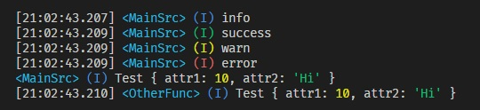

# node-pretty-logger
> Simple library extending `console.log` functionality

A minimal Node.js terminal console.log extension library with formatting for better readability.

Implementation documentation can be found on https://salmon42.github.io/node-pretty-logger.

---


## Usage
The main exported function `useLogger` has one parameter `tag`. Instantiating the encapsulated log functions will ensure that the console log will always mention in what context it is being run in - useful if using multiple loggers across modules.


```ts
const { info, success, warn, error } = useLogger('MainSrc')
const { info: ofInfo } = useLogger('OtherFunc')

const someData = {
	attr1: 10,
	attr2: 'Hi',
}

info('info')
success('success')
warn('warn')
error('error')

setLoggerConfig({ showTimeStamp: false })
info('Test', someData)

setLoggerConfig({ showTimeStamp: true })
ofInfo('Test', someData)
```

**Outputs**:




## License
This library is released under [MIT license](https://opensource.org/license/MIT), which means that you can reuse any part of code here for your convenience.

Copyright (C) 2025-present, Andrej Hučko

<p align="center">
<b>If you like this library, don't hesitate to give this repository a star! 😊</b>
</p>

* ~
